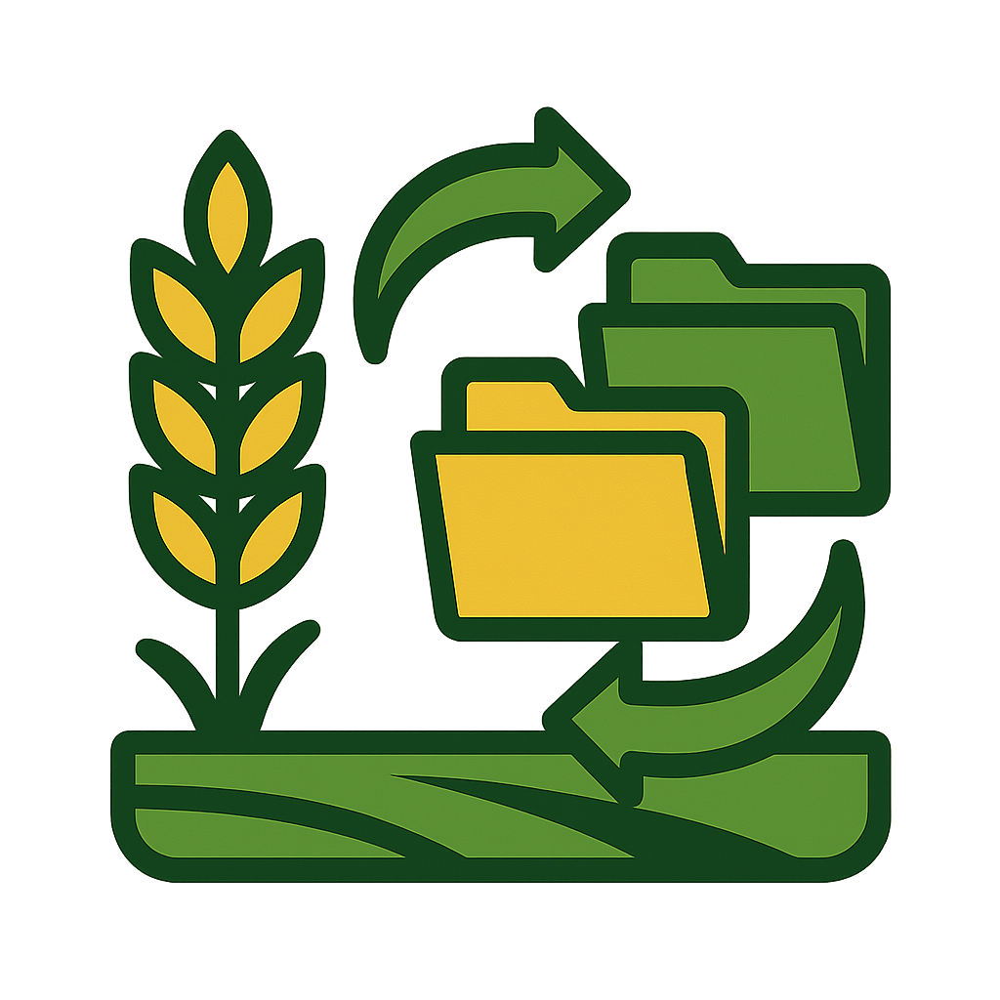

<p align="center">
  
</p>

# FS Mod Sync

A cross-platform desktop application that synchronizes mods from Farming Simulator dedicated servers to your local machine. Supports both FS22 and FS25.


## Features

- Automatically detects game version (FS22/FS25) from server
- Compares local mod versions with server versions
- Downloads only missing or outdated mods

## Usage

1. Enable **Public Mod Download** on your Farming Simulator dedicated server control panel
2. Copy the mods link (e.g., `http://IP:PORT/mods.html`)
3. Run FS Mod Sync and paste the URL
4. Select your local mods directory
5. Click sync to download missing/outdated mods

## Download

Get the latest release from the [Releases](https://github.com/FragnetNetwork/fs-mod-sync/releases) page.

> **Note:** This application is not code-signed. Windows SmartScreen may show a warning when you first run it. Click "More info" then "Run anyway" to proceed.

## Building from Source

Requires Go 1.24+ and Node.js 18+.

```bash
# Install Wails CLI
go install github.com/wailsapp/wails/v2/cmd/wails@latest

# Install frontend dependencies
cd frontend && npm install && cd ..

# Development mode
wails dev

# Build for production
wails build
```

## License

MIT License - see [LICENSE](LICENSE) for details.
